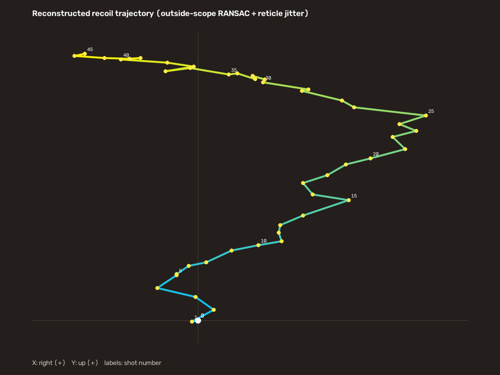

# Recoil Pattern Reconstruction

Reconstruct recoil trajectories from synchronized high-frame-rate video and
raw input using computer vision, robust geometric estimation, and time-aligned
sensor data.



## Overview

The pipeline estimates camera motion from the background while locating the
reticle independently at shot keyframes. It maps those observations into a
common reference frame to recover a time-aligned two-dimensional trajectory.
Every run also exports match quality, RANSAC diagnostics, reticle confidence,
and explicit failure/interpolation status.

```mermaid
flowchart LR
    V[120 FPS video] --> S[frame/event synchronization]
    M[Windows Raw Input] --> S
    S --> F[SIFT or ORB features]
    F --> R[RANSAC + SE(2) motion]
    S --> O[OCR/event detection]
    S --> T[reticle detection]
    R --> C[common-coordinate transform]
    O --> C
    T --> C
    C --> Q[trajectory + quality metrics]
```

## Core algorithms

- Constant-rate 120 FPS capture with QueryPerformanceCounter/common-clock
  synchronization and explicit timing-gap accounting.
- Windows Raw Input capture, either through the standalone DXGI recorder or a
  native OBS sidecar plugin.
- SIFT/ORB feature extraction, KNN matching, Lowe ratio filtering, and RANSAC
  rejection of transient foreground motion.
- Scale-free SE(2) translation/rotation estimation and accumulated inverse
  transforms.
- Reticle localization plus ammunition-display OCR/event detection.
- Per-frame quality gates based on inliers, inlier ratio, reprojection error,
  step size, rotation, and reticle confidence.
- Parallel batch processing with a machine-readable manifest.

## Quick start

Python 3.11+ is recommended.

```bash
python -m venv .venv
# Windows: .venv\Scripts\activate
# Linux/macOS: source .venv/bin/activate
python -m pip install -r requirements.txt

python analyze_recoil.py /path/to/capture.mp4 \
  --output-dir reconstruction_output
```

Automatic mode detects a complete ammunition countdown. For partial or
nonstandard captures, supply all four manual bounds:

```bash
python analyze_recoil.py /path/to/capture.mp4 \
  --start-frame 400 --end-frame 1000 \
  --start-ammo 30 --shot-count 30 \
  --output-dir reconstruction_output
```

Batch a directory without embedding machine-specific paths:

```bash
python batch_reconstruct.py /path/to/videos \
  --output-dir batch_output --max-workers 2
```

## Outputs and validation

- `keyframes_recoil.csv`: event times, common-frame reticle positions,
  cumulative trajectory, and per-event displacement.
- `all_frames_motion.csv`: feature matches, RANSAC inliers, reprojection error,
  SE(2) step, and interpolation status for every analyzed frame.
- `ammo_detection.csv`: display-change scores and detected coarse events.
- `summary.json`: configuration, frame range, event count, and aggregate quality
  metrics.
- `recoil_trajectory.png`, `feature_mask.png`, and a reticle contact sheet for
  visual review.

A small output sample is kept in [`docs/sample_output`](docs/sample_output).
The committed trajectory and masks under [`docs/assets`](docs/assets) are the
only generated images intentionally tracked; runtime output directories are
ignored.

## Documentation

- [Reconstruction pipeline and quality gates](docs/PIPELINE.md)
- [Synchronized capture workflows](docs/CAPTURE.md)
- [OBS Raw Input/frame-clock sidecar plugin](obs_mouse_timeline/README.md)

## Repository structure

```text
analyze_recoil.py          video-only reconstruction pipeline
analyze_synced_recoil.py   synchronized reference/recoil analysis
record_mouse_video.py      DXGI + Raw Input recorder
batch_reconstruct.py       generic parallel batch runner
calibrate_ammo_templates.py
obs_mouse_timeline/        native OBS timing/input sidecar plugin
docs/                      algorithms, capture notes, and sample outputs
```

The public repository intentionally contains no commercial Recoil Trainer
source dependency, product database importer, private captures, or
machine-specific data paths.

## Tests

```bash
python -m compileall -q .
python -m unittest discover -s tests -v
```

## Licensing

The OBS plugin subtree retains its existing GPL-2.0 license. A license for the
remaining top-level Python code has not yet been asserted; confirm ownership and
redistribution constraints before applying a repository-wide license.
